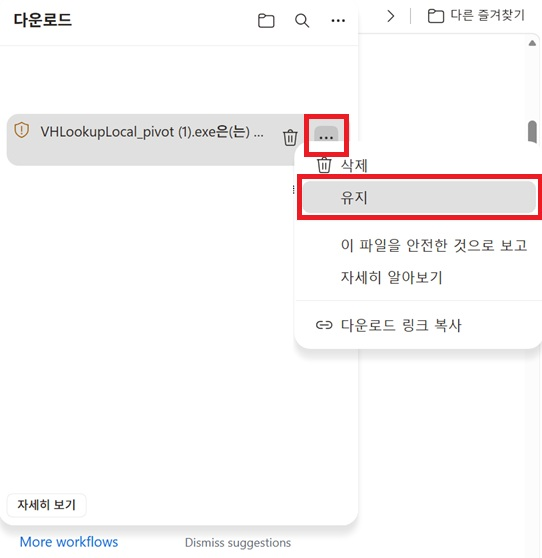
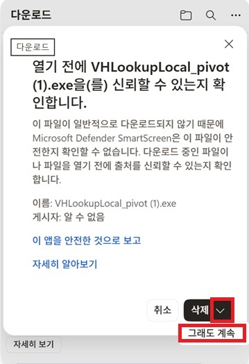
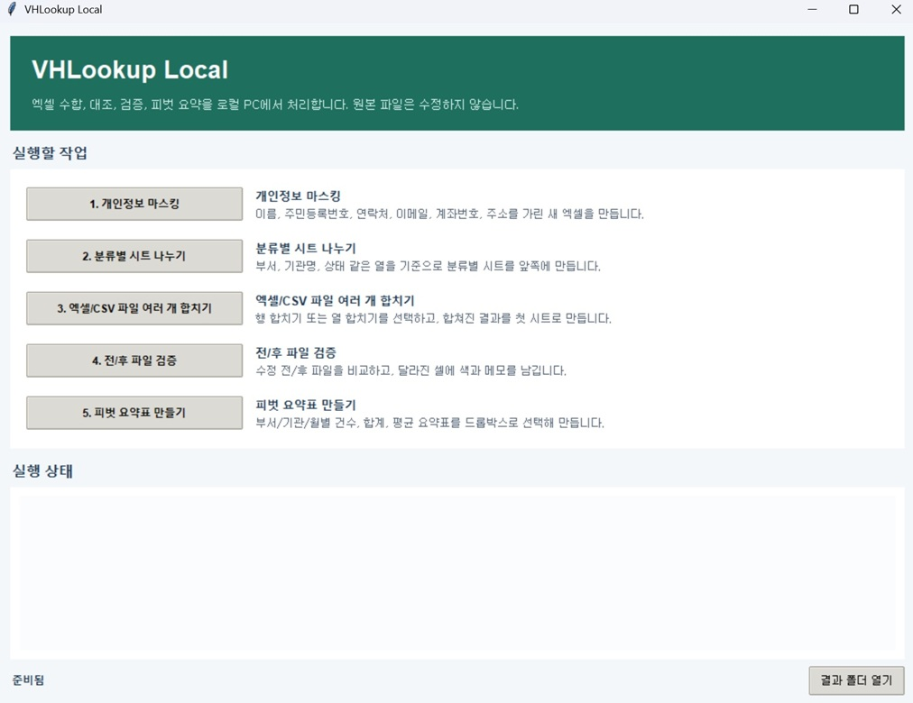

# VHLookup Local V1.1

공공기관, 교육청, 학교, HR, 총무, 예산 담당자가 반복하는 엑셀 수합, 대조, 검증, 요약 업무를 로컬 PC에서 처리하는 Windows용 업무 자동화 도구입니다.

비개발자 사용자는 Python이나 개발 환경을 몰라도 됩니다. 아래 Windows 실행파일을 내려받아 더블클릭해서 사용합니다.

- [VHLookup Local V1.1 Windows 실행파일 다운로드](https://github.com/koul777/VHLookup/releases/latest/download/VHLookupLocal_pivot_v1.1.exe)
- 직접 다운로드가 안 되면 [GitHub Releases](https://github.com/koul777/VHLookup/releases/latest)에서 `VHLookupLocal_pivot_v1.1.exe`를 내려받습니다.

GitHub 소스 저장소에는 빌드 산출물인 `dist` 폴더와 exe 파일을 포함하지 않습니다. exe 파일은 GitHub Release 첨부파일로 배포합니다.

### 다운로드가 차단될 때

Windows 또는 Microsoft Edge에서 `일반적으로 다운로드되지 않음`, `다운로드할 수 없음`, SmartScreen 경고가 나올 수 있습니다. 현재 실행파일은 새로 빌드한 서명되지 않은 exe라서 Microsoft 평판 정보가 충분하지 않을 수 있습니다.

- 공유하거나 안내할 때, Microsoft 피드백이나 오탐 신고를 할 때는 긴 `release-assets.githubusercontent.com/...` 주소를 사용하지 않습니다. 이 주소는 GitHub가 다운로드 순간에 발급하는 임시 주소라 시간이 지나면 만료됩니다.
- 공식 다운로드 주소는 위의 `최신 Windows 실행파일 다운로드` 또는 [GitHub Releases](https://github.com/koul777/VHLookup/releases/latest)입니다.
- 내려받은 파일명이 `VHLookupLocal_pivot_v1.1.exe`인지 확인합니다.
- 파일을 실행하기 전에 PowerShell에서 SHA256을 확인할 수 있습니다.

```powershell
Get-FileHash .\VHLookupLocal_pivot_v1.1.exe -Algorithm SHA256
```

현재 Release 기준 SHA256은 아래와 같습니다.

```text
898191341AAAD542910C78224ABFA6812289919057BC0151C4E64CFF721A4C54
```

공식 Release에서 받은 파일이고 SHA256이 일치하면 Edge 다운로드 목록에서 `유지` 또는 `그래도 유지`를 선택할 수 있습니다. 실행 시 Windows SmartScreen이 뜨면 `추가 정보`를 누른 뒤 실행할 수 있습니다. 기관 PC에서 계속 차단되면 보안 담당자에게 공식 Release 주소와 SHA256을 전달해 허용을 요청해야 합니다.

Edge에서 다운로드가 막히는 경우 아래 화면처럼 진행합니다. 공식 Release에서 받은 파일이고 SHA256이 일치할 때만 진행합니다.

| 1. 다운로드 목록의 `...` 메뉴에서 `유지` 선택 | 2. 확인 창에서 아래 화살표를 누른 뒤 `그래도 계속` 선택 |
| --- | --- |
|  |  |

장기적으로는 실행파일에 코드 서명 인증서를 적용해야 이런 경고가 줄어듭니다.

## 실행 화면



## 최근 업데이트

### 2026-07-04

- 다양한 공공기관 엑셀에서 컬럼명이 달라도 실제 값 겹침을 보고 열 합치기 기준열을 추천합니다.
- `사번`과 `직원번호`, `관리번호`와 `접수ID`처럼 이름이 달라도 값이 맞으면 같은 키 후보로 봅니다.
- `00123`과 `123`처럼 앞자리 0 표시가 다른 기준값도 같은 대상으로 비교합니다.
- 행/열 합치기에서 어느 한쪽에만 있는 행이나 열은 삭제하지 않고 결과에 남기며, 빈 칸은 노란색과 메모로 표시합니다.
- 파일 합치기 결과에는 개인정보 의심 컬럼을 따로 점검하거나 색칠하지 않습니다.
- 전/후 파일 검증에서 컬럼명이 바뀐 경우, 추가 행, 빠진 행, 값 변경을 함께 표시합니다.
- 전/후 파일 검증 결과에서 새로 생긴 행은 파란색, 사라진 행은 첫 시트 아래에 추가해 빨간색으로 표시합니다.
- 피벗 요약표 숫자는 천 단위 콤마와 최대 소수 2자리로 보기 좋게 표시합니다.
- 결과 엑셀은 첫 시트를 실제 결과로 두고, 보조 설명은 `확인사항` 시트 한 장으로 단순화했습니다.
- 합치기 방향은 기본 `자동 선택`으로 두고, 결과 저장 위치는 사용자가 저장 창에서 직접 고릅니다.

[2026-07-04 상세 변경 내역 보기](docs/update_notes_2026-07-04.md)

소스에서 직접 실행 파일을 만들려면 `build_exe.bat`을 실행합니다. 빌드가 끝나면 아래 위치에 exe가 생성됩니다.

```text
dist\VHLookupLocal_pivot_v1.1.exe
```

## 핵심 원칙

- 로컬 PC에서만 실행
- 원본 엑셀/CSV 파일 미수정
- 별도 서버, API, 클라우드 업로드 없음
- 실행할 때 Windows 저장 창에서 결과 파일 위치와 이름을 직접 선택
- 컬럼명이 달라도 자동 추천 후 사용자가 드롭박스로 수정 가능
- 개인정보 처리는 `1. 개인정보 마스킹` 기능에서만 별도로 수행
- 파일 합치기 결과에는 개인정보 의심 표시를 섞지 않음

## 주요 기능

### 1. 개인정보 마스킹

엑셀/CSV 파일에서 개인정보로 보이는 값을 가린 새 결과 파일을 만듭니다.

- 주민등록번호/외국인등록번호: `******-*******` 형태로 전체 마스킹
- 이름/담당자/예금주: `***`로 전체 마스킹
- 연락처: `***`로 전체 마스킹
- 이메일: `***`로 전체 마스킹
- 계좌번호: `***`로 전체 마스킹
- 주소: `***`로 전체 마스킹
- 성별/나이/생년월일: `***`로 전체 마스킹
- 비고 같은 일반 텍스트 안의 생년월일 문맥도 마스킹
- 마스킹된 셀은 색으로 표시하고, 넓은 메모에 마스킹 유형 표시
- `마스킹내역` 시트에는 원본 값 없이 행 번호, 컬럼명, 마스킹 유형만 기록

마스킹 예시:

| 원본 | 결과 |
| --- | --- |
| `홍길동` | `***` |
| `서울특별시 중구 세종대로 110` | `***` |
| `hong@example.go.kr` | `***` |
| `남` / `38` / `1988-08-11` | `***` |
| `900101-1234567` | `******-*******` |
| `880811-5234567` | `******-*******` |
| `010-1234-5678` | `***` |
| `110123456789` | `***` |
| `생년월일 1900/01/01` | `생년월일 ***` |
| `93년8월11일생` | `***생` |
| `생년 930811` | `생년 ***` |

### 2. 분류별 시트 나누기

한 파일을 특정 열 기준으로 여러 시트로 나눕니다.

- 부서, 기관명, 학교명, 상태, Department 같은 열 기준
- 기준 열은 드롭박스로 선택
- 원본 전체 시트와 분류별 시트 생성

### 3. 엑셀/CSV 파일 여러 개 합치기

여러 파일을 한 결과 파일로 합칩니다.

- `행 합치기`: 같은 양식의 여러 파일을 아래로 이어 붙임
- `열 합치기`: 공통 키를 찾아 다른 파일의 열을 오른쪽에 붙임
- 기본값은 `자동 선택`이며 파일 구조를 보고 행/열 합치기를 추천
- 컬럼명이 달라도 동의어, 이름 유사도, 실제 값 겹침으로 자동 매칭
- `사번`과 `직원번호`, `관리번호`와 `접수ID`처럼 이름이 달라도 값이 충분히 겹치면 키 후보로 추천
- `00123`과 `123`처럼 앞자리 0 표시가 다른 숫자형 키도 같은 대상으로 비교
- 월별 지급자료처럼 단일 열만으로 중복되는 경우 `사번 + 지급월` 같은 복합 키 자동 추천
- 어느 한쪽에만 있는 기준값도 행을 삭제하지 않고 결과에 남김
- 한쪽 파일에만 있는 행이나 열은 빈 칸에 노란색과 메모로 표시
- 결과 첫 시트에는 원본 파일명, 원본 시트명, 원본 행 번호 같은 내부 추적 컬럼을 표시하지 않음
- 파일 합치기에서는 개인정보 의심 컬럼을 따로 점검하거나 색칠하지 않음
- 자동 매칭이 틀리면 `컬럼 매칭 수정`에서 드롭박스로 직접 지정
- 미리보기에서 앞 10행 확인 후 실행

### 4. 전/후 파일 검증

수정 전 파일과 수정 후 파일을 비교합니다.

- 같은 의미의 컬럼을 자동 매칭
- 비교 기준열 자동 추천
- 컬럼명이 바뀌어도 실제 값 겹침이 높으면 같은 컬럼으로 비교
- `001`과 `1`처럼 앞자리 0 표시가 다른 기준값도 같은 행으로 비교
- 자동 추천이 틀리면 `컬럼 매칭 수정`에서 비교 기준열과 전/후 컬럼 직접 지정
- 값이 바뀐 셀, 추가 행, 누락 행, 추가/삭제 컬럼 확인
- 결과 파일의 `후파일_메모` 시트에서 변경 셀 메모 확인
- 후 파일에 새로 생긴 행은 파란색 전체 행으로 표시
- 후 파일에서 사라진 행은 `후파일_메모` 시트 맨 아래에 전 파일 값으로 추가하고 빨간색 전체 행으로 표시
- 추가 행, 빠진 행, 컬럼 변경은 `확인사항` 시트에서 확인

### 5. 피벗 요약표 만들기

부서별, 기관별, 월별, 상태별 요약표를 만듭니다.

- 행 기준 선택
- 열 기준 선택 또는 선택 안 함
- 값 열 선택
- 집계 방식 선택: `건수`, `합계`, `평균`, `최대`, `최소`
- `건수`는 값 열 없이 행 개수 집계
- `합계`, `평균`, `최대`, `최소`는 숫자 값 열 기준 집계
- 결과 숫자는 천 단위 콤마와 최대 소수 2자리로 보기 좋게 표시
- 결과 시트: `피벗요약`, `확인사항`

## 사용 순서

1. 전달받은 `VHLookupLocal_pivot_v1.1.exe`를 더블클릭합니다. 직접 빌드한 경우에는 `dist\VHLookupLocal_pivot_v1.1.exe`를 실행합니다.
2. 실행할 작업 버튼을 선택합니다.
3. 파일을 올립니다.
4. 미리보기에서 예상 결과를 확인합니다.
5. 자동 추천이 틀리면 드롭박스에서 컬럼 매칭이나 기준 열을 수정합니다.
6. `실행`을 누릅니다.
7. 저장 창에서 결과 파일을 저장할 폴더와 파일명을 선택합니다.
8. 저장이 끝나면 선택한 결과 폴더가 열립니다.

## 샘플 데이터

샘플은 프로그램 안에서 새로 만들지 않고 파일로 제공합니다. 폴더는 실행 화면의 1~5번 기능 순서에 맞춰 정리되어 있습니다.

```text
samples\public_admin
```

샘플 CSV는 Windows Excel에서 더블클릭으로 열어도 한글이 깨지지 않도록 UTF-8 BOM 형식으로 저장했습니다.

### 폴더 구조

```text
samples\public_admin
├─ 01_privacy_masking
├─ 02_split_sheets
├─ 03_merge_files
│  ├─ row_merge_school_submissions
│  ├─ row_merge_messy_headers
│  ├─ row_merge_submission_errors
│  ├─ column_merge_hr_training
│  └─ column_merge_allowance_budget
├─ 04_before_after_validation
├─ 05_pivot_summary
└─ 90_extra_cli_samples
```

### 메뉴별 샘플

**개인정보 마스킹**

- 누를 기능: `1. 개인정보 마스킹`
- 선택할 파일: `samples\public_admin\01_privacy_masking\citizen_service_requests.csv`
- 결과에서 먼저 볼 시트: `마스킹결과`
- 그 다음 참고 시트: `마스킹내역`
- 확인 포인트: 이름, 주민등록번호/외국인등록번호, 연락처, 이메일, 계좌번호, 주소, 성별, 나이, 생년월일이 가려졌는지 확인

**부서별 시트 나누기**

- 누를 기능: `2. 분류별 시트 나누기`
- 선택할 파일: `samples\public_admin\02_split_sheets\budget_execution.csv`
- 화면 선택값: 분류 기준열 `부서`
- 결과에서 먼저 볼 시트: `총무과`, `예산과`, `복지과`, `민원과` 같은 분류별 시트
- 그 다음 참고 시트: `전체`, `확인사항`

**제출자료 행 합치기**

- 누를 기능: `3. 엑셀/CSV 파일 여러 개 합치기`
- 선택할 파일:
  - `samples\public_admin\03_merge_files\row_merge_school_submissions\gangbuk_school.csv`
  - `samples\public_admin\03_merge_files\row_merge_school_submissions\gangnam_school.csv`
- 화면 선택값: 합치기 방향 `자동 선택` 또는 `행 합치기`
- 결과에서 먼저 볼 시트: `결과`
- 그 다음 참고 시트: `확인사항`

**제목/안내문 있는 파일 행 합치기**

- 누를 기능: `3. 엑셀/CSV 파일 여러 개 합치기`
- 선택할 파일:
  - `samples\public_admin\03_merge_files\row_merge_messy_headers\department_status_a.csv`
  - `samples\public_admin\03_merge_files\row_merge_messy_headers\department_status_b.csv`
- 화면 선택값: 합치기 방향 `자동 선택` 또는 `행 합치기`
- 결과에서 먼저 볼 시트: `결과`
- 그 다음 참고 시트: `확인사항`

**직원 명단 열 합치기**

- 누를 기능: `3. 엑셀/CSV 파일 여러 개 합치기`
- 선택할 파일:
  - `samples\public_admin\03_merge_files\column_merge_hr_training\hr_training_completion.csv`
  - `samples\public_admin\03_merge_files\column_merge_hr_training\hr_employee_master.csv`
- 화면 선택값: 합치기 방향 `자동 선택` 또는 `열 합치기`, 자동 매칭 확인
- 결과에서 먼저 볼 시트: `결과`
- 그 다음 참고 시트: `확인사항`

**수당/예산 기준표 열 합치기**

- 누를 기능: `3. 엑셀/CSV 파일 여러 개 합치기`
- 선택할 파일:
  - `samples\public_admin\03_merge_files\column_merge_allowance_budget\payment_requests.csv`
  - `samples\public_admin\03_merge_files\column_merge_allowance_budget\rate_reference.csv`
- 화면 선택값: 합치기 방향 `자동 선택` 또는 `열 합치기`, 자동 매칭 확인
- 결과에서 먼저 볼 시트: `결과`
- 그 다음 참고 시트: `확인사항`

**전/후 파일 변경 검증**

- 누를 기능: `4. 전/후 파일 검증`
- 선택할 파일:
  - 수정 전: `samples\public_admin\04_before_after_validation\payment_before.csv`
  - 수정 후: `samples\public_admin\04_before_after_validation\payment_after.csv`
- 화면 선택값: 비교 기준열 자동 추천 확인, 필요 시 `컬럼 매칭 수정`
- 결과에서 먼저 볼 시트: `후파일_메모`
- 그 다음 참고 시트: `확인사항`
- 확인 포인트:
  - `E002`: 금액/비고 변경 셀이 노란색과 메모로 표시
  - `E004`: 후 파일에 새로 생긴 행이므로 파란색 전체 행으로 표시
  - `E003`: 후 파일에서 사라진 행이므로 맨 아래에 추가되고 빨간색 전체 행으로 표시

**부서/월별 예산 피벗**

- 누를 기능: `5. 피벗 요약표 만들기`
- 선택할 파일: `samples\public_admin\05_pivot_summary\budget_execution.csv`
- 화면 선택값: 행 기준 `부서`, 열 기준 `월`, 값 열 `금액`, 집계 방식 `합계`
- 결과에서 먼저 볼 시트: `피벗요약`
- 그 다음 참고 시트: `확인사항`

**상태별 처리 건수 피벗**

- 누를 기능: `5. 피벗 요약표 만들기`
- 선택할 파일: `samples\public_admin\05_pivot_summary\budget_execution.csv`
- 화면 선택값: 행 기준 `상태`, 열 기준 `(선택 안 함)`, 값 열 `(행 개수)`, 집계 방식 `건수`
- 결과에서 먼저 볼 시트: `피벗요약`
- 그 다음 참고 시트: `확인사항`

월별 가로표 변환과 제출대상 누락 확인처럼 현재 첫 화면 1~5번 버튼 밖에 있는 샘플은 `samples\public_admin\90_extra_cli_samples`에 따로 뒀습니다.

샘플 종류와 확인 포인트는 [docs/sample_catalog.md](docs/sample_catalog.md)에 더 자세히 정리되어 있습니다.

## 결과 파일

결과 파일은 실행할 때 뜨는 저장 창에서 사용자가 선택한 위치에 생성됩니다. 저장 창에서 취소하면 결과 파일을 만들지 않습니다.

자주 보는 시트:

- `결과`: 수합, 행/열 합치기, 대조 결과
- `확인사항`: 자동 매칭 근거, 한쪽 파일에만 있는 행/열, 확인할 점을 한곳에 모은 시트
- `마스킹결과`: 개인정보가 가려진 결과표
- `마스킹내역`: 원본 값 없이 마스킹 위치와 유형만 기록한 시트
- `후파일_메모`: 전/후 파일 검증에서 변경 셀 메모가 붙은 후 파일
- `피벗요약`: 피벗 요약표 결과

### 색상 기준

| 기능 | 색상 | 의미 |
| --- | --- | --- |
| 파일 합치기 | 노란색 | 한쪽 파일에만 있어 비어 있는 셀입니다. 메모에서 어떤 파일에만 있는지 확인합니다. |
| 전/후 파일 검증 | 노란색 | 값이 바뀐 셀입니다. 메모에서 전 값과 후 값을 확인합니다. |
| 전/후 파일 검증 | 파란색 | 후 파일에 새로 생긴 행입니다. |
| 전/후 파일 검증 | 빨간색 | 후 파일에서 사라진 행입니다. 첫 시트 맨 아래에 전 파일 값으로 추가됩니다. |
| 개인정보 마스킹 | 노란색 | 개인정보 마스킹이 적용된 셀입니다. |

파일 합치기 결과에서는 `성명`, `연락처` 같은 개인정보 의심 컬럼이라는 이유만으로 색칠하지 않습니다. 개인정보 처리는 `1. 개인정보 마스킹`에서 따로 실행합니다.

## exe 다시 만들기

배포용 exe를 다시 만들 때는 아래 파일을 실행합니다.

```text
build_exe.bat
```

빌드가 끝나면 아래 파일이 생성됩니다.

```text
dist\VHLookupLocal_pivot_v1.1.exe
```

## 테스트

개발자가 기능 검증을 할 때 사용합니다.

```powershell
$env:PYTEST_DISABLE_PLUGIN_AUTOLOAD='1'; python -m pytest
```

현재 주요 테스트는 다음 업무 흐름을 검증합니다.

- 분류별 시트 나누기
- 행/열 합치기
- 컬럼 자동 매칭
- 다른 이름의 컬럼과 앞자리 0이 다른 키 자동 매칭
- 전/후 파일 검증
- 전/후 파일 검증의 추가 행, 빠진 행, 이름이 바뀐 컬럼 비교
- 피벗 요약표
- 공공기관 행정 샘플 처리

## CLI 사용

데스크톱 앱 없이 명령어로도 일부 기능을 실행할 수 있습니다.

```powershell
python -m vhlookup_cli.main inspect --path "C:\path\submissions" --out inspect.xlsx
python -m vhlookup_cli.main consolidate --folder "C:\path\submissions" --out result.xlsx
python -m vhlookup_cli.main lookup --reference master.xlsx --target submitted.xlsx --out lookup_result.xlsx
python -m vhlookup_cli.main reconcile --reference expected.xlsx --target received.xlsx --out missing_result.xlsx
python -m vhlookup_cli.main horizontal --file monthly.xlsx --out monthly_long.xlsx
```

비개발자용 기본 사용은 CLI가 아니라 배포용 `VHLookupLocal_pivot_v1.1.exe` 실행입니다.

## 관련 문서

- [실행안내.md](실행안내.md): 비개발자용 실행 순서
- [docs/update_notes_2026-07-04.md](docs/update_notes_2026-07-04.md): 2026-07-04 상세 변경 내역
- [docs/sample_catalog.md](docs/sample_catalog.md): 샘플 데이터 카탈로그
- [docs/security_review_brief.md](docs/security_review_brief.md): 보안 검토 설명

## 구조

- `src/vhlookup_core`: 파일 로더, 헤더 탐지, 컬럼 매칭, 수합, 대조, 피벗, 리포트 작성
- `src/vhlookup_app`: Windows 데스크톱 GUI
- `src/vhlookup_cli`: 명령어 실행 도구
- `samples`: 샘플 데이터
- `tests`: 자동 테스트
